# Production / Development Separation Governance

Status: active after Phase 4.7-S2.

This project now has a production baseline library. Development work must not use production DB, storage, source roots, or private ledgers as a casual test fixture.

## Separate Lanes

```mermaid
flowchart LR
    subgraph DEV["Develop / feature branches"]
        DDB["dev or test DB"]
        DST["dev/test storage"]
        DFIX["fixtures or restored snapshots"]
        DVAL["unit, contract, focused browser validation"]
    end

    subgraph PROD["Production lane"]
        PDB["production DB"]
        PST["production app-managed storage"]
        PSRC["approved production source roots"]
        PDRY["production dry-run"]
        PEXEC["explicitly approved production execution"]
    end

    DEV --> REVIEW["PR review + contracts + redaction"]
    REVIEW --> PROMOTE["operator-approved promotion"]
    PROMOTE --> PROD
```

## Rules

- Production DB, production storage, and production source roots must not be used directly by develop feature branches.
- Develop branches must use a dev/test DB, dev/test storage, fixtures, or restored snapshots.
- A develop failure must not be able to corrupt production DB rows, production app-managed media files, production source roots, or production private ledgers.
- Promotion to production requires PR review, executable contracts, backup proof, production dry-run where applicable, browser validation for UI-visible changes, and public redaction checks.
- Automatic production writes remain opt-in and disabled by default.
- Production source/iCloud hydration is allowed only under an explicitly approved production workflow with bounded failure budgets, private ledgers, and redacted public reports.
- Private artifacts remain local ignored artifacts. Public artifacts must be aggregate-only and path-redacted.

## Production Promotion Checklist

- PR branch reviewed and not pushed to `main`.
- Python/runtime identity verified.
- Production DB identity resolved through app settings.
- Backup proof valid and recovery notes documented.
- Source roots registered, active, safe, and non-overlapping with repo/storage/output/test storage.
- Dynamic sync dry-run completed at the intended scope.
- Execute confirmation present for any production import/classification/AI/localization run.
- Failure budgets checked before claiming completion.
- Browser/gallery/search validation completed when user-visible behavior is in scope.
- Public reports pass redaction and do not expose local paths, private labels, credentials, source filenames, or private ledgers.
